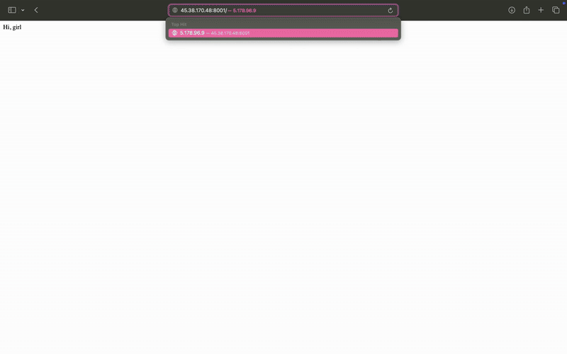

# Reverse Proxy Load Balancer System

---
## Overview

This system simulates a reverse proxy (load balancer) that distributes incoming requests to backend servers based on the least number of active connections. The backend servers simulate long-lived sessions or compute-intensive endpoints. The project is designed to handle HTTP-based web service requests and efficiently distribute them using a front-end load balancer.

---
## Demo

---
## System Components

1. **Load Balancer (Gateway)**: This component is responsible for distributing incoming HTTP requests to backend servers based on their load.
2. **Backend Servers**: These servers handle requests from the load balancer. They simulate long-lived sessions or compute-intensive tasks.

---
## Key Features

- **Iterative Request Redirection**: Unlike traditional proxy systems, this solution uses an iterative approach to redirect clients to the backend server with the least active connections.
- **High Traffic Scalability**: The system optimizes resource utilization and improves scalability for high-traffic environments.
- **Centralized Control**: Despite the distributed backend architecture, the system maintains centralized control for optimal routing decisions.

---
---
# Technologies Used

- : Lightweight and high-performance async HTTP server.
- , : Async HTTP clients for backend communication.
- : Containerization.
- : Used for orchestrating all containers and services across nodes.
- : Security monitoring and agent-based system-level log collection.
- : Aggregation and storage of **application logs**.
- : Visualization of logs and metrics.

---

## Deployment

The system was deployed using **Nomad** as the orchestration platform across multiple virtual machines.

### 🧩 Infrastructure Setup

- All components were orchestrated using Nomad job specifications.
- **Wazuh Agent** was deployed via Nomad on every node for system-level security monitoring.
- **Loki** was also deployed through Nomad on every node, collecting and aggregating **application logs**.
- The **application code** (load balancer and backend services) was deployed only to appropriate nodes using Nomad's job constraints to control placement.
- Each component was declared in a dedicated `.nomad` job file for reproducibility.

### 📡 Observability

Logs are handled by a unified logging stack:
- **Wazuh Agent** collects system-level and security-relevant logs.
- **Loki** aggregates application-level logs (e.g., from the load balancer and backend containers).
- **Promtail** forwards logs to Loki.
- **Grafana** provides a dashboard for viewing and analyzing logs in real time.

### 🔗 Live Demo

Click to view the live system in action:  
👉 [Live Demo Link](https://demo-url.com)

---

> 💡 This deployment strategy ensures better scalability, security, and separation of concerns between logging, orchestration, and service logic.

### Contributing

Feel free to fork this repository and submit pull requests. Any contributions to improve the system, such as adding new features, enhancing performance, or improving security, are welcome!

---
>## Contacts
>
>>### Artem Ostapenko
>>- Telegram: [@ostxxp](https://t.me/ostxxp)
>>- Email: [a.ostapenko@innopolis.university](mailto:a.ostapenko@innopolis.university)
>
>>### Aliya Sagdieva
>>- Telegram: [@aliyushka_sgdv](https://t.me/aliyushka_sgdv)
>>- Email: [a.sagdieva@innopolis.university](mailto:a.sagdieva@innopolis.university)
>
>>### Ivan Lobazov
>>- Telegram: [@XriXis](https://t.me/XriXis)
>>- Email: [i.lobazov@innopolis.university](mailto:i.lobazov@innopolis.university)
>
>>### Elizaveta Zagurskih
>>- Telegram: [@wkwthigo](https://t.me/wkwthigo)
>>- Email: [e.zagurskih@innopolis.university](mailto:e.zagurskih@innopolis.university)
---

### License
This project is licensed under the MIT License - see the [LICENSE](LICENSE) file for details.
